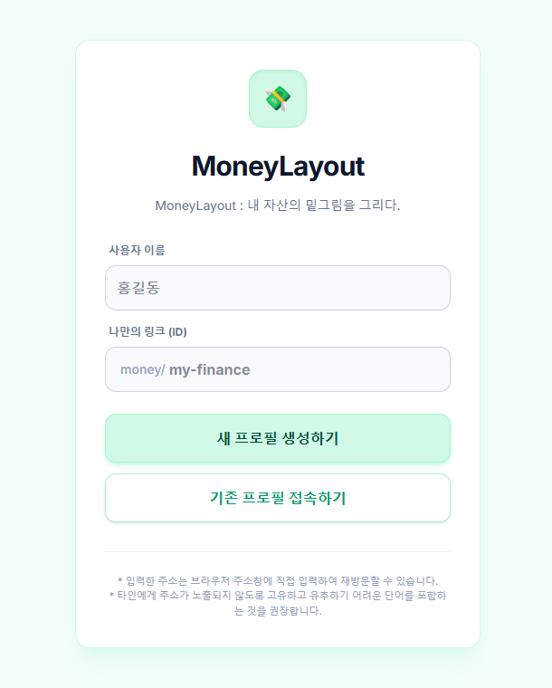

# 📈 MoneyLayout: Your Financial Blueprint

**나만의 자산 설계도.** 복잡한 가입 없이 고유 URL만으로 관리하는 지능형 재무 설계 대시보드입니다. ㅡㅡ

## 🚀 주요 기능 (Main Features)

- **🔗 Unique Access:** 별도의 로그인 없이 생성된 고유 URL만으로 나만의 데이터를 안전하게 관리.
- **🛠️ Custom Layout:** 수입(월급, 법카, 수당), 지출, 저축, 투자 등 모든 항목을 본인의 라이프스타일에 맞게 커스터마이징.
- **🔮 Future Forecast:** 현재 잔액과 월 납입액을 바탕으로 계산되는 '1년 뒤 예상 자산' 실시간 확인.
- **💸 Flow Analysis:** 총 수입에서 모든 고정 비용을 제외한 순수 '가용 현금 흐름' 자동 계산.

## 🛠️ 기술 스택 (Tech Stack)

| Category | Technology |
| :--- | :--- |
| **Frontend** | HTML5, CSS3, JavaScript (ES6+) |
| **Backend** | Supabase (Database & API) |
| **Styling** | Tailwind CSS / Modern Dashboard UI |
| **Deployment** | Vercel |

## 🎨 미리보기 (Preview)

## 💡 개발 배경 (Background)

이 프로젝트는 정책팀 재직자이자 **'예비 개발자'**인 이엘이 직접 제작했습니다. 단순한 가계부를 넘어, 수학적 로직을 통해 미래 자산을 설계하고 1인 프리랜서로 나아가는 자산 로드맵 구축을 목표로 합니다. ㅡㅡ

## ⚠️ 주의 사항 (Notice)

- **Security:** 본인의 고유 URL이 노출되지 않도록 주의하세요. 주소가 곧 본인의 열쇠입니다.
- **Update:** 모든 데이터는 실시간으로 Supabase에 안전하게 저장됩니다.

## 👨‍💻 Creator

**이엘 (EL)** *Policy Team Member & Future Developer*